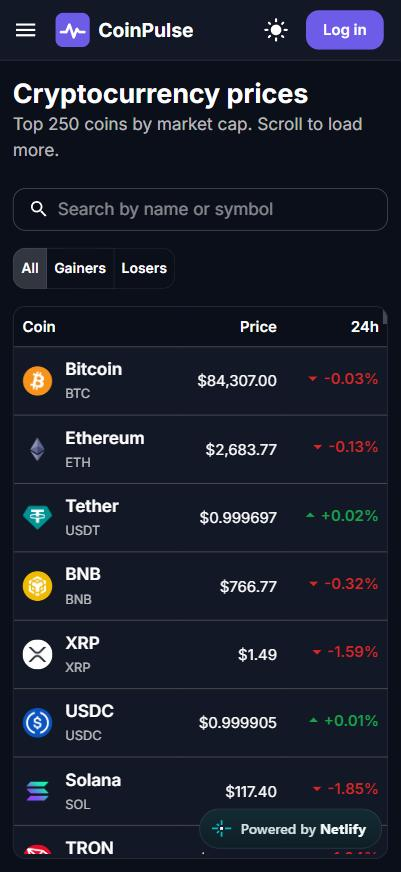

# CoinPulse

A crypto portfolio tracker built with **React 19, TypeScript, Redux Toolkit, TanStack Query, Firebase and Material UI**.

Browse 2,000+ coins in a fast virtualized table, open any coin for price charts and stats, keep a personal watchlist, and record buy/sell transactions to see your portfolio value and profit/loss in USD or INR.

**🔗 Live demo: [prasad-coinpulse.netlify.app](https://prasad-coinpulse.netlify.app/)**

<p align="center">
  
</p>

---

## Features

- **Authentication**: email/password signup and login, Google sign-in, password reset, logout. Session is restored on reload.
- **Protected routes**: watchlist, portfolio and settings need login. After logging in you're sent back to the page you wanted.
- **Markets**: top 2,000 coins by market cap, loaded 250 at a time with **infinite scroll**. The table is **virtualized**, so only the visible rows are in the DOM. It supports sorting, debounced search and gainers/losers filters.
- **Coin details**: price chart (24H / 7D / 1M / 1Y), market stats and a description.
- **Watchlist**: add or remove coins with **optimistic updates** that roll back if the save fails.
- **Portfolio**: buy/sell transactions, holdings with average buy price, unrealized and realized profit/loss, 24h change, and an allocation pie chart.
- **Forms**: React Hook Form + Zod validation, including a rule that stops you selling more than you hold.
- **Settings**: dark/light theme and USD/INR currency, saved in localStorage. You can also edit your display name.
- **Quality**: lazy-loaded routes, loading skeletons, error and empty states, a route error boundary, 404 page and responsive layout.

## Tech stack

| Area | Tools |
| --- | --- |
| Framework | React 19, TypeScript (strict), Vite |
| Routing | React Router 7 (data router, lazy routes, protected and public-only layout routes) |
| Client state | Redux Toolkit (auth session, theme and currency, market filters) |
| Server state | TanStack Query (caching, infinite queries, optimistic mutations, retry with backoff) |
| Backend | Firebase Authentication + Cloud Firestore (with security rules) |
| REST API | CoinGecko public API |
| UI | Material UI 7, Recharts |
| Tables | TanStack Table (sorting) + TanStack Virtual (row virtualization) |
| Forms | React Hook Form + Zod |
| Testing | Vitest, React Testing Library, user-event, MSW (Mock Service Worker) |
| Tooling | ESLint, Prettier, GitHub Actions CI |

## Handling CoinGecko's rate limit

The free CoinGecko API allows only a limited number of requests per minute. When you go over it, CoinGecko replies with HTTP 429, but that response has no CORS headers. The browser therefore hides the status code and `fetch` simply fails with **"Failed to fetch"**.

CoinPulse handles this in a few ways:

- **Friendly errors:** network failures are turned into an `ApiError` with a clear message instead of the raw "Failed to fetch".
- **Automatic retries:** temporary errors (rate limit, network, 5xx) are retried up to 4 times with exponential backoff (2s, 4s, 8s, 16s), spreading the retries across the rate-limit window.
- **Caching:** prices are cached for 2 minutes, and coin details and charts for 5 minutes, so moving between pages doesn't send new requests.
- **Cached data stays visible:** if a background refresh fails, the table, chart or portfolio keeps showing the last good data with a small warning, instead of being replaced by an error.
- **Optional free API key:** a Demo key gives a much higher limit.

## Why the state is split this way

- **Redux Toolkit holds client state**, which the browser owns: who is logged in, the theme, the currency and the market filters. The filters live in Redux so they're still there when you open a coin and come back.
- **TanStack Query holds server state**, which belongs to an API: CoinGecko prices and the Firestore watchlist and transactions. It handles caching, deduplication, background refetching and loading/error states.
- **Every amount is stored in USD**, and INR is only a display conversion. The USD→INR rate comes from Bitcoin's price in both currencies.
- **Profit/loss uses the average-cost method** (see `src/features/portfolio/holdings.ts`). It's a pure function with its own unit tests.

## Project structure

```
src/
├── api/                 # CoinGecko REST client, response types, React Query keys
├── components/
│   ├── common/          # Shared UI: loaders, empty/error states, dialogs
│   ├── form/            # MUI + React Hook Form field
│   └── layout/          # App bar, navigation, theme and currency toggles
├── features/
│   ├── auth/            # Firebase auth service, login/signup pages, route guards
│   ├── coin/            # Coin detail page + price chart
│   ├── markets/         # Virtualized markets table, filters
│   ├── portfolio/       # Transactions (Firestore), holdings maths, charts, form
│   ├── settings/
│   └── watchlist/       # Firestore watchlist + optimistic toggle
├── hooks/               # React Query hooks for CoinGecko, useDebounce
├── lib/                 # Firebase init, QueryClient, formatters
├── store/               # Redux store, slices, typed hooks
├── test/                # Test setup, MSW server + handlers, fixtures, render helper
├── theme/               # MUI theme (light/dark)
└── router.tsx           # Routes (all pages lazy loaded)
```

Tests sit next to the code they test (`*.test.ts(x)`).

---

## Getting started

### 1. Requirements

- [Node.js](https://nodejs.org/) 20 or newer
- A free Firebase account (no credit card needed)

### 2. Install

```bash
npm install
```

### 3. Set up Firebase (about 5 minutes, free Spark plan)

1. Go to the [Firebase console](https://console.firebase.google.com/), click **Create project**, name it `coinpulse`, and turn off Google Analytics.
2. **Authentication**: go to **Build → Authentication → Get started**, then enable **Email/Password** and **Google**.
3. **Firestore**: go to **Build → Firestore Database → Create database**, pick the location `asia-south1 (Mumbai)`, and choose **production mode**.
4. **Security rules**: in Firestore, open the **Rules** tab, paste the contents of [`firestore.rules`](./firestore.rules) and click **Publish**. Each user can then only read and write their own data.
5. **Web app keys**: go to **Project settings (gear icon) → Your apps → Web (`</>`)**, register an app (no hosting needed) and copy the `firebaseConfig` values.
6. Copy `.env.example` to `.env` and paste the values:

```bash
cp .env.example .env
```

```env
VITE_FIREBASE_API_KEY=AIza...
VITE_FIREBASE_AUTH_DOMAIN=coinpulse-xxxx.firebaseapp.com
VITE_FIREBASE_PROJECT_ID=coinpulse-xxxx
VITE_FIREBASE_STORAGE_BUCKET=coinpulse-xxxx.firebasestorage.app
VITE_FIREBASE_MESSAGING_SENDER_ID=1234567890
VITE_FIREBASE_APP_ID=1:1234567890:web:abc123
```

> Firebase web keys are designed to be public. Your data is protected by the security rules, not by hiding the keys.

**Recommended:** create a free [CoinGecko Demo API key](https://www.coingecko.com/en/api/pricing) (no credit card needed) and set `VITE_COINGECKO_API_KEY`. Without a key, CoinGecko only allows a few requests per minute per visitor, so the app will sometimes show "CoinGecko's free API is busy" while it waits and retries.

### 4. Run

```bash
npm run dev
```

Open http://localhost:5173.

The markets and coin pages work even before Firebase is set up. Login, the watchlist and the portfolio need the Firebase keys.

## Scripts

| Command | What it does |
| --- | --- |
| `npm run dev` | Start the dev server |
| `npm run build` | Type-check and build for production |
| `npm run preview` | Preview the production build |
| `npm test` | Run all tests once |
| `npm run test:watch` | Run tests in watch mode |
| `npm run test:coverage` | Run tests with a coverage report |
| `npm run lint` | Lint with ESLint |
| `npm run typecheck` | Type-check with TypeScript |
| `npm run format` | Format with Prettier |

## Testing

Tests use **Vitest** (its API matches Jest's) with **React Testing Library**. **MSW** intercepts network requests, so tests never hit the real CoinGecko API, and Firebase services are mocked.

What's covered:

- **Unit tests**: currency/percent formatting, portfolio maths (average cost, realized and unrealized P&L), Redux slices, market filtering, API client and retry rules
- **Component tests**:
  - login and signup validation, success and error handling
  - protected and public-only route redirects
  - the transaction form, including the oversell rule and the "use current price" button
  - the markets table: API loading, search, filters, INR display and error/retry
  - the watchlist button, including the optimistic update and rollback

## Deploying to Netlify (free)

1. Push the project to GitHub.
2. In [Netlify](https://app.netlify.com/), choose **Add new site → Import an existing project** and pick the repo. The build settings come from `netlify.toml`.
3. Under **Site configuration → Environment variables**, add the same `VITE_FIREBASE_*` values from your `.env`, plus `VITE_COINGECKO_API_KEY` if you have one.
4. Deploy, then in the Firebase console go to **Authentication → Settings → Authorized domains** and add your Netlify domain (for example `coinpulse.netlify.app`). Google sign-in needs this.

`netlify.toml` already redirects every route to `index.html`, so refreshing a page like `/portfolio` works.

## Credits

Market data from the [CoinGecko API](https://www.coingecko.com/en/api).
